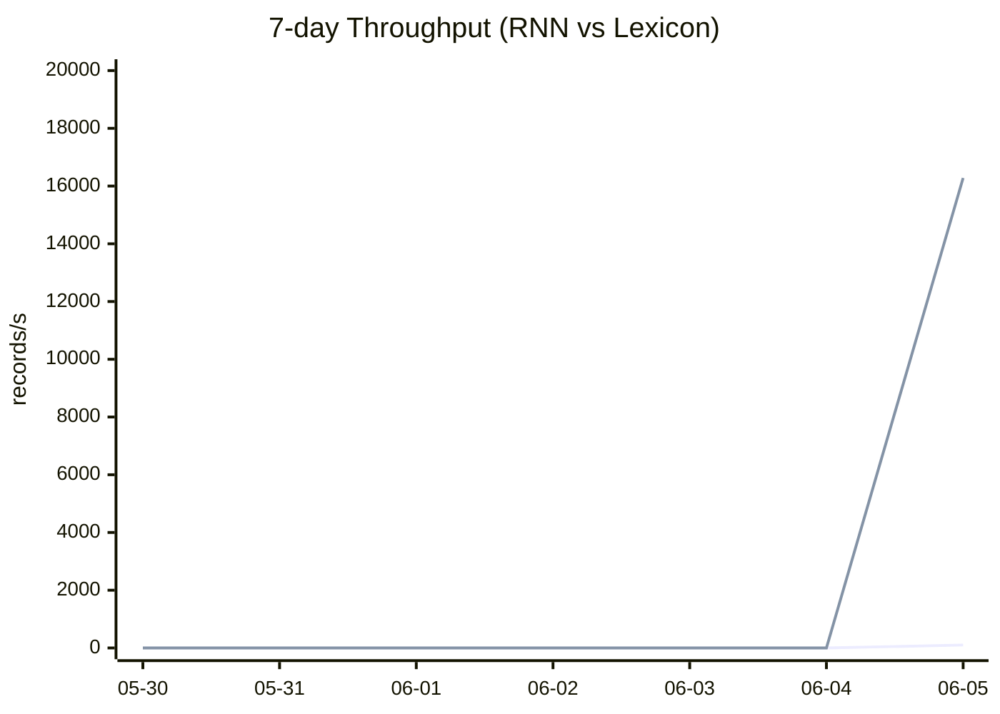
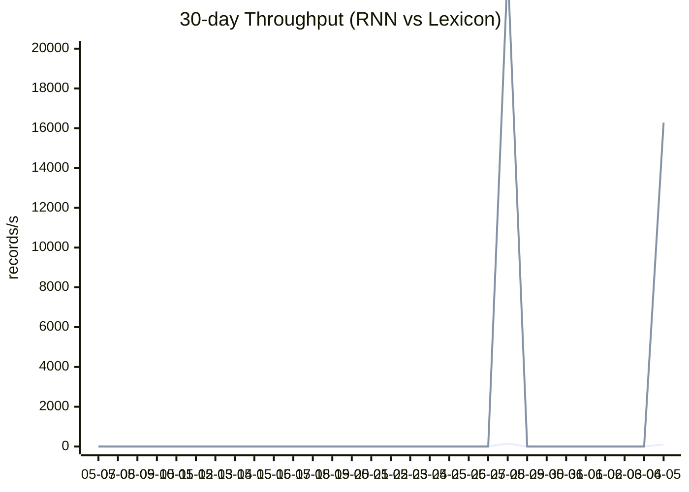

# AB Monitoring Report

- Runs: 4
- Records: 820
- Errors: 0

## Adaptive RNN Ratio
- Current: 0.412891
- Target: 0.538282
- Recommended: 0.492891

## 7-day Throughput Trend

## 30-day Throughput Trend
